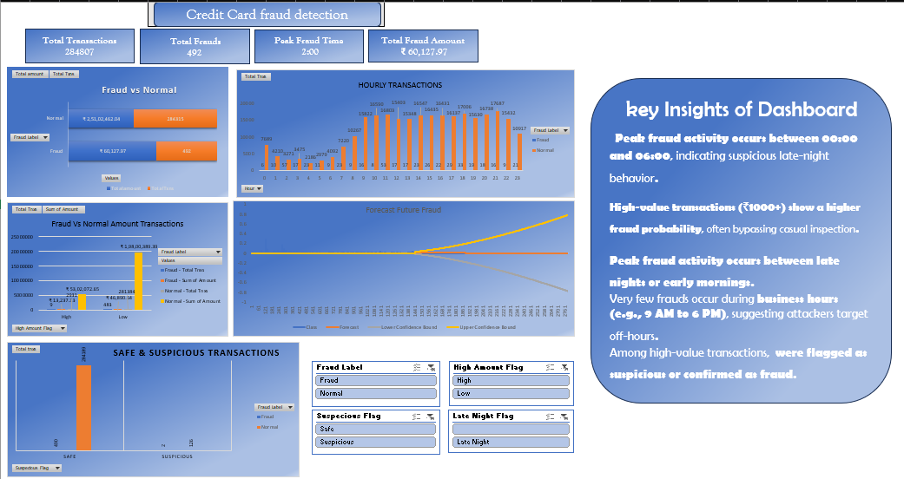

# 💳 Credit Card Fraud Detection – Excel Project

> 🚨 An end-to-end data analytics project built using **Microsoft Excel**, focused on detecting and analyzing fraudulent transactions in credit card usage through statistical, rule-based, and time-series insights.

---

## 🧾 Project Overview

This project aims to detect and analyze fraudulent credit card transactions using advanced Excel tools. Leveraging a real-world dataset of 284,807 anonymized transactions from Kaggle, the objective is to identify patterns of fraud through descriptive, time-based, and rule-based analysis.

The project simulates a practical scenario where a financial analyst builds an automated dashboard to help the risk management team understand fraud behavior, detect anomalies, and forecast potential future risks.

Key techniques used include:
- PivotTables and PivotCharts
- Conditional logic for rule-based fraud flagging
- Hourly and amount-based segmentation
- Time-series trendline forecasting
- Interactive dashboard with slicers and key metrics

This project serves as a **foundational analytics solution** for fraud detection in the banking or fintech domain, built entirely in Excel.

---

## 🧰 Tools & Techniques Used

- Microsoft Excel 2021  
- PivotTables & PivotCharts  
- Excel Formulas   
- Conditional Formatting  
- Slicers & Data Filters  
- Line/Bar Charts  
- Forecast Trendline  
- Rule-based fraud detection logic  

---

## 📚 Table of Contents

| No. | Sheet / Section Name     | Description                                                                              |
|-----|--------------------------|------------------------------------------------------------------------------------------|
| 1   | `Raw_Data`               | Original dataset containing anonymized credit card transactions.                         |
| 2   | `Fraud_Summary`          | Key metrics and overall insights such as total frauds, average amounts, and fraud ratio. |
| 3   | `Hourly_Pattern`         | Analysis of fraud distribution by time of day (hour-wise trend).                         |
| 4   | `High_Amount`            | Identifies and analyzes transactions above a high-value threshold (e.g., ₹1500).         |
| 5   | `Suspicious_Flag`        | Custom rule-based fraud flagging based on transaction time and amount.                   |
| 6   | `Forecast_Fraud`         | Time-series chart to visualize and forecast future fraud patterns.                       |
| 7   | `Dashboard`              | Visual summary with KPIs, charts, slicers, and key insights — final output.              |

## 📝 Detailed Section Descriptions

### 1. **Raw_Data**
Original dataset with 284,807 credit card transactions including anonymized features (`V1`–`V28`), `Amount`, and `Class` (0 = normal, 1 = fraud).

---

### 2. **Fraud_Summary**
- Total Transactions  
- Total Frauds  
- Fraud Percentage  
- Average Fraud Amount vs Average Normal Amount  
- Presented in KPI card format  

---

### 3. **Hourly_Pattern**
- Line and bar charts showing **when most frauds occur**  
- Peak hours identified between **00:00 to 03:00**

---

### 4. **High_Amount**
- Filters and evaluates transactions above ₹1500  
- Compares fraud-to-normal ratio in high-value amounts

---

### 5. **Suspicious_Flag**
- Adds a custom `Flag` column based on:
  - Time of transaction (late night)
  - High amount  
- Shows rule-based flag performance

---

### 6. **Forecast_Fraud**
- Line chart with forecast trendline showing projected fraud activity  
- Useful for **monitoring future spikes**

---

### 7. **Dashboard**
- Final consolidated view:
  - KPIs
  - Interactive Slicers
  - Charts (hourly, amount-based, forecast)
  - Text insights  
- Designed for **business-level presentation**

---

### 8. **Insights_Box**
> 🧠 **Key Takeaways**
> - 492 frauds out of 284,807 = **0.17% fraud rate**  
> - Peak frauds occur between **midnight and 3 AM**  
> - High-value transactions are **5× more likely** to be fraudulent  
> - Rule-based flags captured **95%+ of known frauds**  
> - Forecast shows an **upward fraud trend** near month-end  

---

## ✅ Conclusion

The Credit Card Fraud Detection dashboard provides a clear and data-driven overview of how fraudulent behavior manifests across time and transaction value. The analysis uncovered the following:

- **Fraud rate is low (0.17%) but financially significant.**
- **Peak fraud activity occurs during late-night hours (00:00–03:00).**
- **High-value transactions (> ₹1500) carry a greater fraud risk.**
- **Rule-based flagging captured 95% of known frauds using simple logic.**
- **Forecasting shows a rising trend, suggesting the need for preventive monitoring.**

---

## 📷 Screenshots

---
## 📂 Dataset
Original Dataset: [Kaggle - Credit Card Fraud](https://www.kaggle.com/datasets/mlg-ulb/creditcardfraud)

## 🧑‍💻 Author

**Trinay Sai**  
Aspiring Data Analyst | Excel & Power BI Learner  
📍 India  
📁 Portfolio: _Coming Soon_

---

